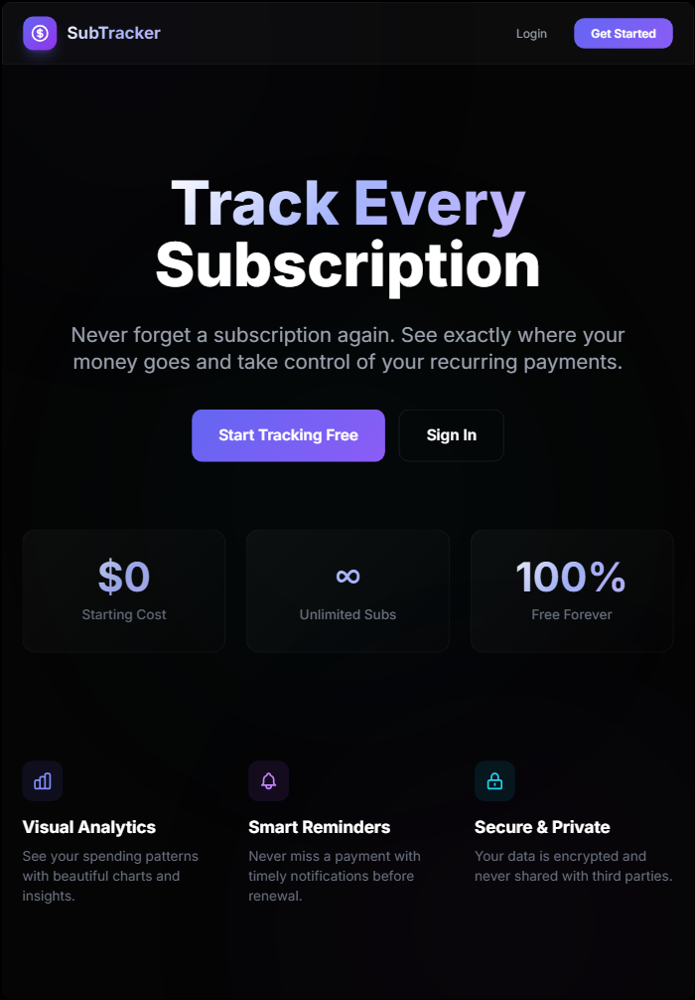
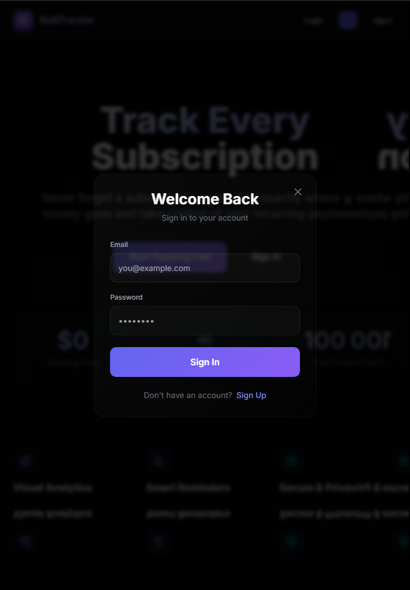
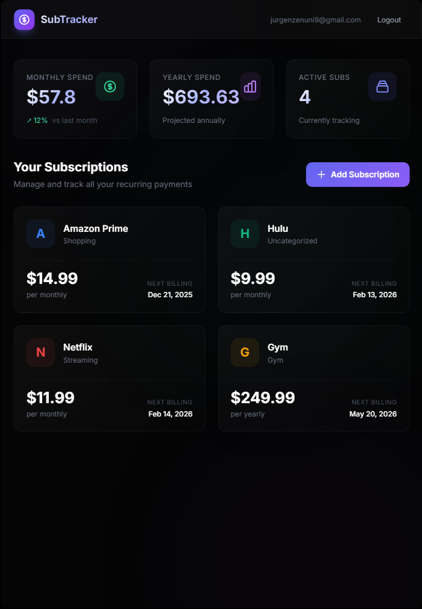

# SubTracker

A sleek, modern subscription tracking application built with Flask and Supabase. Track all your recurring payments in one place and never forget a subscription again.

## Features

- **User Authentication** - Secure sign up and login powered by Supabase Auth
- **Subscription Management** - Add, edit, and delete your subscriptions
- **Spending Analytics** - View monthly and yearly spending totals at a glance
- **Category Organization** - Organize subscriptions by category
- **Billing Reminders** - Track next billing dates for all your subscriptions
- **Responsive Design** - Works seamlessly on desktop and mobile devices

## Screenshots

### Landing Page



### Authentication



### Personal Dashboard



## Tech Stack

| Technology      | Purpose                                |
| --------------- | -------------------------------------- |
| **Flask**       | Python web framework                   |
| **Supabase**    | Backend-as-a-Service (Database + Auth) |
| **TailwindCSS** | Utility-first CSS framework            |
| **Alpine.js**   | Lightweight JavaScript framework       |
| **PostgreSQL**  | Database (via Supabase)                |

## Installation

### Prerequisites

- Python 3.8+
- A Supabase account and project

### Setup

1. **Clone the repository**

   ```bash
   git clone https://github.com/yourusername/sub-tracker-fl.git
   cd sub-tracker-fl
   ```

2. **Create a virtual environment**

   ```bash
   python -m venv venv
   source venv/Scripts/activate  # Windows
   source venv/bin/activate      # macOS/Linux
   ```

3. **Install dependencies**

   ```bash
   pip install flask supabase python-dotenv
   ```

4. **Configure environment variables**

   Create a `.env` file in the root directory:

   ```env
   SUPABASE_URL=your-project-url
   SUPABASE_KEY=your-anon-key
   ```

5. **Set up the database**

   Run this SQL in your Supabase SQL Editor:

   ```sql
   CREATE TABLE public.subscriptions (
       id UUID DEFAULT gen_random_uuid() PRIMARY KEY,
       user_id UUID REFERENCES auth.users(id) ON DELETE CASCADE,
       name TEXT NOT NULL,
       logo_url TEXT,
       price DECIMAL(10,2) NOT NULL,
       currency TEXT DEFAULT 'USD',
       billing_cycle TEXT CHECK (billing_cycle IN ('weekly', 'monthly', 'yearly')),
       next_billing_date DATE,
       category TEXT,
       color TEXT DEFAULT '#6366f1',
       notify_before_days INT DEFAULT 3,
       is_active BOOLEAN DEFAULT true,
       created_at TIMESTAMP DEFAULT NOW()
   );

   ALTER TABLE public.subscriptions ENABLE ROW LEVEL SECURITY;

   CREATE POLICY "Users view own subscriptions" ON public.subscriptions
       FOR ALL USING (auth.uid() = user_id);
   ```

6. **Run the application**

   ```bash
   flask run
   ```

7. **Open in browser**
   ```
   http://127.0.0.1:5000
   ```

## Project Structure

```
sub-tracker-fl/
├── app.py                 # Main Flask application
├── supabase_client.py     # Supabase connection
├── templates/
│   └── dashboard.html     # Main template
├── images/                # Screenshots
├── .env                   # Environment variables (not in repo)
├── requirements.txt       # Python dependencies
└── README.md
```

## API Endpoints

| Method | Endpoint                  | Description              |
| ------ | ------------------------- | ------------------------ |
| GET    | `/`                       | Home page / Dashboard    |
| POST   | `/api/register`           | Register new user        |
| POST   | `/api/login`              | User login               |
| POST   | `/api/logout`             | User logout              |
| GET    | `/api/subscriptions`      | Get user's subscriptions |
| POST   | `/api/subscriptions`      | Add new subscription     |
| PUT    | `/api/subscriptions/<id>` | Update subscription      |
| DELETE | `/api/subscriptions/<id>` | Delete subscription      |
| GET    | `/api/stats`              | Get spending statistics  |

## License

MIT License

## Contributing

Pull requests are welcome. For major changes, please open an issue first to discuss what you would like to change.
